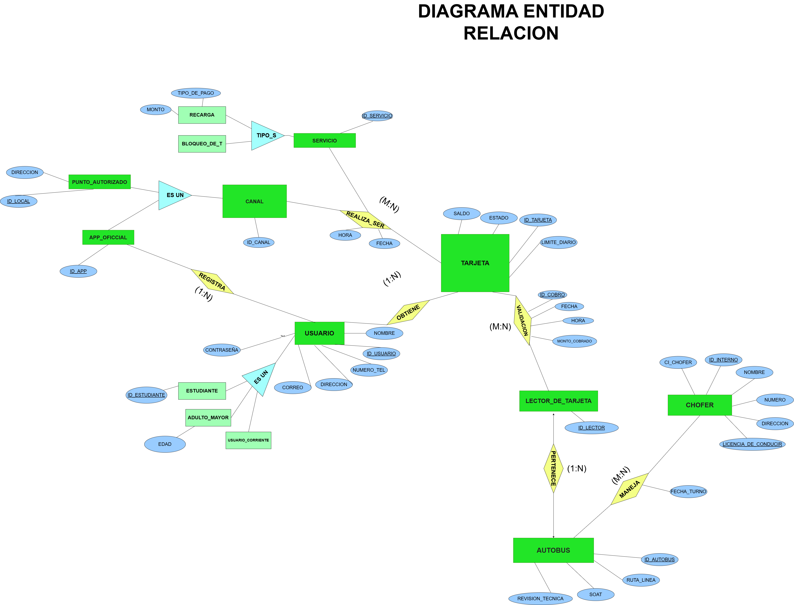

# 🚌 Sistema de Control y Gestión de Transporte Público


Este repositorio contiene el diseño, modelado e implementación de un **Sistema de Control Automatizado para el Transporte Público urbano**. El objetivo principal es centralizar la gestión de usuarios, optimizar el recaudo mediante tarjetas electrónicas y asegurar la trazabilidad operativa de la flota de autobuses.

---

## 📌 1. Descripción de la Problemática y Requisitos

El sistema actual de transporte público enfrenta desafíos críticos que impactan directamente en su rentabilidad, seguridad y calidad de servicio:

* **Falta de Trazabilidad en el Cobro:** Al no existir una conexión automatizada entre el usuario y el autobús, la gestión de los ingresos reales depende de procesos manuales, lo que genera fugas latentes de capital.
* **Dificultad en la Aplicación de Tarifas Diferenciadas:** La validación manual de beneficios para **Estudiantes** o **Adultos Mayores** es lenta, ineficiente y propensa a falsificaciones o errores humanos al no contar con un cruce de datos instantáneo.
* **Vacío de Información Operativa:** Actualmente, no hay forma de auditar con precisión qué chofer estaba al mando de qué autobús en un momento exacto, dificultando la asignación de responsabilidades ante incidentes o flujos inusuales de pasajeros.
* **Mantenimiento y Cumplimiento Legal:** Existe un alto riesgo operativo al no monitorear digitalmente la vigencia de documentos mandatorios como el **SOAT** y la **Revisión Técnica** de los autobuses antes de salir a ruta.
* **Fragmentación en los Canales de Recarga:** La dependencia exclusiva de puntos físicos limitados para recargar saldo genera fricción e inconvenientes al usuario, haciendo necesaria la integración de canales digitales oficiales (Apps).

---

## 🛠️ 2. Diseño de la Solución

Para mitigar estas problemáticas, la arquitectura de la base de datos se estructuró bajo un enfoque modular:

1.  **Módulo de Identificación (Usuarios):** Se implementa una jerarquía/herencia donde la entidad `USUARIO` centraliza los datos personales, permitiendo que las sub-entidades `ESTUDIANTE` y `ADULTO_MAYOR` apliquen tarifas diferenciadas de manera automática en el punto de validación.
2.  **Módulo de Pago (Tarjetas):** La entidad `TARJETA` actúa como el nexo financiero del modelo. Almacena el `SALDO` y se vincula directamente al `ID_USUARIO`, garantizando que el beneficio tarifario sea personal e intransferible.
3.  **Módulo de Hardware (Lectores y Buses):** Se establece una relación de pertenencia estricta de uno a uno ($1:1$) entre el `LECTOR_DE_TARJETA` y el `AUTOBUS`. Toda transacción capturada por un lector se asocia inmediatamente a una unidad física específica.
4.  **Validación de Documentación:** La entidad `AUTOBUS` integra campos mandatorios para el `SOAT` y la `REVISION_TECNICA`. El software evalúa estos campos, quedando capacitado para deshabilitar el lector si la documentación legal de la unidad está vencida.
5.  **Integridad de Datos:** El uso estricto de claves primarias e índices únicos (`ID_USUARIO`, `CORREO`, `ID_TARJETA`, `CI_CHOFER`, `ID_AUTOBUS`) previene duplicidades, fraudes de identidad o registros huérfanos.
6.  **Módulo de Gestión Digital (Canales y Servicios):** Centraliza la experiencia del usuario a través de canales físicos (`PUNTO_AUTORIZADO`) y digitales (`APLICACION_OFICIAL`), permitiendo consultas de saldo y recargas eficientes mediante una superclase unificada (`CANAL`).

---

## 📐 3. Modelo Entidad-Relación (MER)



El modelo de datos se compone de **9 Entidades** estratégicas interconectadas mediante **6 Relaciones** de negocio bien definidas.

### 🏢 Entidades Principales
* USUARIO: Superclase que centraliza los datos personales (CI, Nombre, Teléfono, Correo, Dirección). Se especializa en ESTUDIANTE, ADULTO_MAYOR y USUARIO_CORRIENTE.

* TARJETA: Monedero electrónico que almacena el saldo, estado y límites de cobro diarios.

* CHOFER: Personal operativo que conduce las unidades (identificado por su CI, Licencia y Teléfono).

* AUTOBUS: Unidad de transporte físico donde se controlan las placas, ruta, SOAT y Revisión Técnica.

* LECTOR_DE_TARJETA: Dispositivo electrónico de hardware instalado a bordo para procesar los pagos.

* CANAL: Superclase abstracta para los medios de recarga. Se especializa en PUNTO_AUTORIZADO (físico) y APP_OFICIAL (digital).

* SERVICIO: Modalidad o tipo de ruta de transporte que interactúa con el sistema.

### 🔗 Matriz de Relaciones y Cardinalidades

| Relación | Entidad A | Entidad B | Cardinalidad | Descripción |
| :--- | :--- | :--- | :---: | :--- |
| **OBTIENE** | `USUARIO` | `TARJETA` | $1:N$ | Un usuario varias tarjeta (si se pierde puede obtener otra) activa asociada a su identidad. |
| **PERTENECE** | `AUTOBUS` | `LECTOR_DE_TARJETA` | $1:1$ | Cada autobús tiene instalado exactamente un lector de tarjetas asignado. |
| **MANEJA** | `CHOFER` | `AUTOBUS` | $N:M$ | Relación histórica de turnos; un chofer maneja varios buses y un bus es conducido por varios choferes en fechas distintas. |
| **VALIDACION** | `TARJETA` | `LECTOR_DE_TARJETA` | $N:M$ | Registra cada transacción o cobro individual (Fecha, Hora, Monto) cuando una tarjeta pasa por un lector. |
| **RECARGA** | `CANAL` | `TARJETA` | $N:M$ | Una tarjeta puede recibir múltiples recargas monetarias a través de distintos canales habilitados. |
| **REALIZA_SERVICIO** | `CANAL` | `SERVICIO` | $N:M$ | Vincula los canales digitales y físicos con los tipos de servicio de transporte que soportan operaciones. |

---

## 🚀 4. Estructura del Proyecto en el Repositorio

```text
📁 proyecto_sistema_transporte
 │
 └── 📁 pro
      │── 📄 base de datos.sql        # Script de creación de tablas, llaves e inserts de prueba
      │── 📄 sistema_transporte.py    # Lógica de conexión y backend de la aplicación
